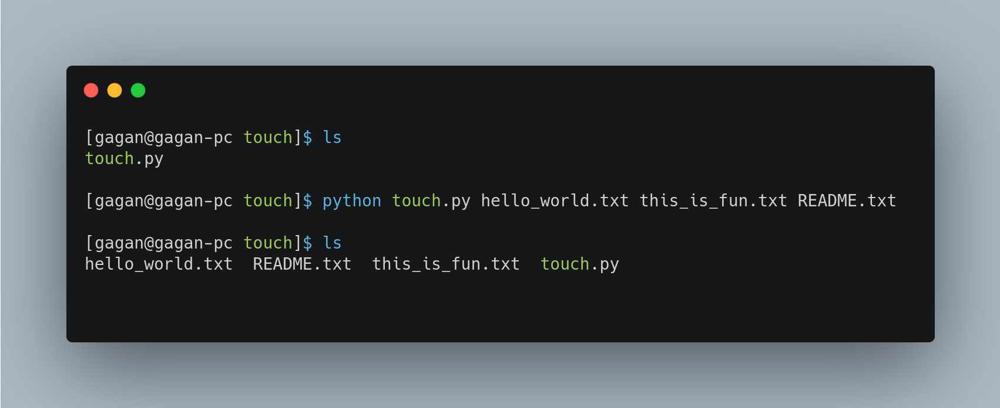
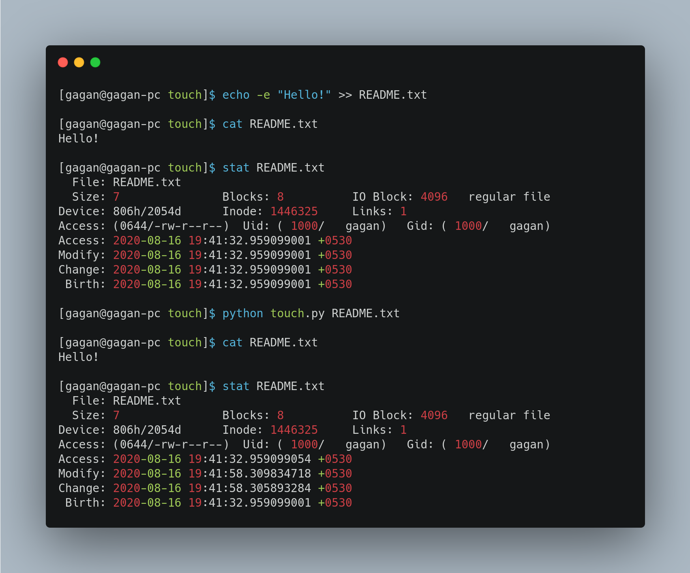

# Touch Command (Python Script)

This is a simple script which can create multiple files and updates the modified time if files exist.

In other words, It mimics the functionality of touch command in Linux.

## Usage

### For creating single file

```bash
python touch.py <filename>
```

### For creating multiple files

```bash
python touch.py <filename1> <filename2> <filename3>
```

## Examples

### Creating Multiple Files



### Updating Modified time of existing file


